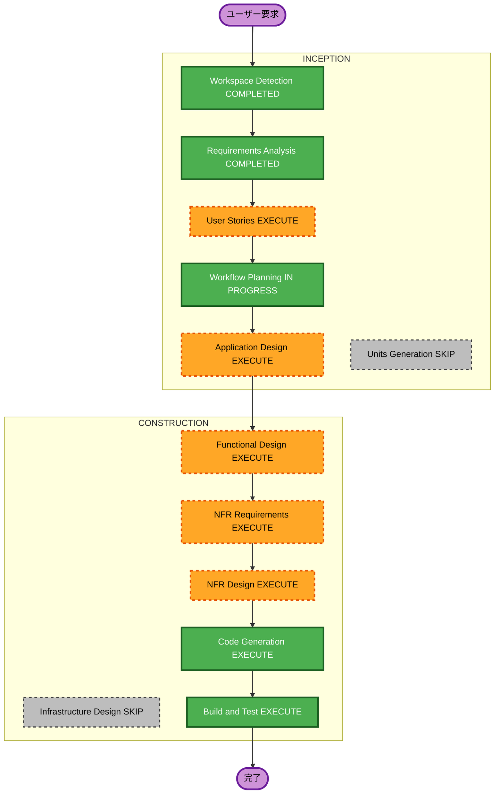

# 実行計画

## 詳細分析サマリー

### 変更影響評価

- **ユーザー向け変更**: あり。新規の画像アップロードと説明表示のUI。
- **構造変更**: あり。バックエンドとフロントエンドを新規構築。
- **データモデル変更**: あり。APIリクエストとレスポンスのスキーマを新規定義。
- **API変更**: あり。`/api/v1/descriptions` と `/health` を新規追加。
- **NFR影響**: あり。セキュリティ、アクセシビリティ、可観測性、テスト。

### リスク評価

- **リスクレベル**: 中
- **主なリスク**: OpenAI API連携、機密情報の取り扱い、入力検証
- **ロールバック複雑度**: 容易（新規プロジェクト）
- **テスト複雑度**: 中（外部APIをモック）

## ワークフロー可視化

### Mermaid

### テキスト代替

- INCEPTION: Workspace Detection 完了 -> Requirements Analysis 完了 -> User Stories 実行 -> Workflow Planning 実行中 -> Application Design 実行 -> Units Generation スキップ
- CONSTRUCTION: Functional Design 実行 -> NFR Requirements 実行 -> NFR Design 実行 -> Infrastructure Design スキップ -> Code Generation 実行 -> Build and Test 実行

## 実行・スキップするステージ

### INCEPTION

- [x] Workspace Detection (COMPLETED)
- [x] Reverse Engineering (SKIPPED - greenfield)
- [x] Requirements Analysis (COMPLETED)
- [x] User Stories (EXECUTE) - 新規のユーザー向けフローで価値が高い
- [x] Workflow Planning (IN PROGRESS)
- [ ] Application Design (EXECUTE) - 新規コンポーネントとサービス層の定義が必要
- [ ] Units Generation (SKIP) - 単一の凝集した単位で分割不要

### CONSTRUCTION

- [ ] Functional Design (EXECUTE) - 入力検証、詳細度、AIサービスの業務ロジック
- [ ] NFR Requirements (EXECUTE) - セキュリティ、性能、テストの技術選定
- [ ] NFR Design (EXECUTE) - セキュリティヘッダー、レート制限、例外処理の設計
- [ ] Infrastructure Design (SKIP) - クラウド配備は対象外
- [ ] Code Generation (EXECUTE, ALWAYS)
- [ ] Build and Test (EXECUTE, ALWAYS)

## 単位（ユニット）

単一ユニット `image-description-app` として扱い、バックエンドとフロントエンドの2モジュールで構成する。

## 成功基準

- **主目的**: 画像を日本語で説明するローカル動作アプリの提供
- **主要成果物**: FastAPI/PydanticAIバックエンド、Next.js/Reactフロントエンド、テスト、README
- **品質ゲート**: lint、型検査、バックエンドとフロントエンドのテスト成功

## タイムライン

- 実行ステージ数: 10
- 想定: 単一セッションで設計から実装、検証まで実施
